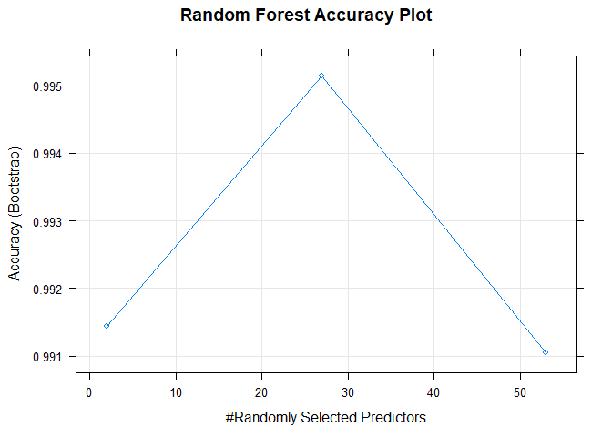

Executive Summary
=================

Background
----------

Using devices such as Jawbone Up, Nike FuelBand, and Fitbit it is now possible to collect a large amount of data about personal activity relatively inexpensively. These type of devices are part of the quantified self movement - a group of enthusiasts who take measurements about themselves regularly to improve their health, to find patterns in their behavior, or because they are tech geeks. One thing that people regularly do is quantify how much of a particular activity they do, but they rarely quantify how well they do it. In this project, your goal will be to use data from accelerometers on the belt, forearm, arm, and dumbell of 6 participants. They were asked to perform barbell lifts correctly and incorrectly in 5 different ways. More information is available from the website here: <http://web.archive.org/web/20161224072740/http:/groupware.les.inf.puc-rio.br/har> (see the section on the Weight Lifting Exercise Dataset).

About the Project
-----------------

The goal of your project is to predict the manner in which they did the exercise. This is the "classe" variable in the training set. You may use any of the other variables to predict with. You should create a report describing how you built your model, how you used cross validation, what you think the expected out of sample error is, and why you made the choices you did. You will also use your prediction model to predict 20 different test cases.

Import Libraries and Load Data
==============================

Download training and test data sets and save it in a variable.

``` r
library(caret)
```

    ## Loading required package: lattice

    ## Loading required package: ggplot2

``` r
library(kernlab)
```

    ## 
    ## Attaching package: 'kernlab'

    ## The following object is masked from 'package:ggplot2':
    ## 
    ##     alpha

``` r
library(ggplot2)
library(lattice)
library(rpart.plot)
```

    ## Loading required package: rpart

``` r
train <- read.csv(url("https://d396qusza40orc.cloudfront.net/predmachlearn/pml-training.csv"),header=TRUE)
test <- read.csv(url("https://d396qusza40orc.cloudfront.net/predmachlearn/pml-testing.csv"),header=TRUE)
```

Cleaning and Partitioning of Data sets
--------------------------------------

In this section, we take the training set, and we split the training set itself up, into training and test sets. But first, data should be filtered to eliminate unwanted data like NA and blank values in most observation values.

Choosing Prediction Model
=========================

There are different ways to predict outcomes but choosing 2 most relevant approach at the very start of the proccess can save so much time to solve a specific problem like this one. One thing to do after choosing a specific algorithm is to check the model complexity of the data sets. In this case, the model has more computational overhead, thus choosing decision tree and random forest are the models relevant to problem.

Predicting with Trees
---------------------

### Pros

1.  Easy to interpret
2.  Better performance in nonlinear settings

### Cons

1.  Without pruning/cross-validation can lead to overfitting
2.  Harder to estimate uncertainty
3.  Results may be variable

``` r
set.seed(11)
modFitTree <- train(classe~., data = training[-1], method="rpart")
modFitTree
```

    ## CART 
    ## 
    ## 13737 samples
    ##    53 predictor
    ##     5 classes: 'A', 'B', 'C', 'D', 'E' 
    ## 
    ## No pre-processing
    ## Resampling: Bootstrapped (25 reps) 
    ## Summary of sample sizes: 13737, 13737, 13737, 13737, 13737, 13737, ... 
    ## Resampling results across tuning parameters:
    ## 
    ##   cp          Accuracy   Kappa    
    ##   0.04053504  0.5239770  0.3862650
    ##   0.05994643  0.4105300  0.2016021
    ##   0.11606144  0.3278207  0.0693108
    ## 
    ## Accuracy was used to select the optimal model using the largest value.
    ## The final value used for the model was cp = 0.04053504.

``` r
rpart.plot(modFitTree$finalModel, main = "Decision Tree Accuracy Plot")
```


It can be observed that the acccuracy of the model is at maximum of 54% with a kappa statistic of 41%. According to the result using decision tree, the accurracy and the kappa statistic is very low (less than 60%). However, it can still be used to predict and see if the accurracy are low.

``` r
TreePred<- predict(modFitTree, testing)
confusionMatrix(TreePred, testing$classe)
```

    ## Confusion Matrix and Statistics
    ## 
    ##           Reference
    ## Prediction    A    B    C    D    E
    ##          A 1521  507  457  411  150
    ##          B   32  378   34  185  159
    ##          C  117  254  535  368  293
    ##          D    0    0    0    0    0
    ##          E    4    0    0    0  480
    ## 
    ## Overall Statistics
    ##                                          
    ##                Accuracy : 0.4952         
    ##                  95% CI : (0.4823, 0.508)
    ##     No Information Rate : 0.2845         
    ##     P-Value [Acc > NIR] : < 2.2e-16      
    ##                                          
    ##                   Kappa : 0.3403         
    ##  Mcnemar's Test P-Value : NA             
    ## 
    ## Statistics by Class:
    ## 
    ##                      Class: A Class: B Class: C Class: D Class: E
    ## Sensitivity            0.9086  0.33187  0.52144   0.0000  0.44362
    ## Specificity            0.6379  0.91361  0.78761   1.0000  0.99917
    ## Pos Pred Value         0.4993  0.47970  0.34142      NaN  0.99174
    ## Neg Pred Value         0.9461  0.85070  0.88629   0.8362  0.88854
    ## Prevalence             0.2845  0.19354  0.17434   0.1638  0.18386
    ## Detection Rate         0.2585  0.06423  0.09091   0.0000  0.08156
    ## Detection Prevalence   0.5176  0.13390  0.26627   0.0000  0.08224
    ## Balanced Accuracy      0.7732  0.62274  0.65453   0.5000  0.72140

Using this model to predict my testing data, it shows that the accuracy is about 50% and still very low.

Random Forest
-------------

### Pros

1.  Accuracy

### Cons

1.  Speed
2.  Interpetability
3.  Overfitting

``` r
set.seed(11)
modFit <- train(classe~., data = training[-1], method="rf")
modFit
```

    ## Random Forest 
    ## 
    ## 13737 samples
    ##    53 predictor
    ##     5 classes: 'A', 'B', 'C', 'D', 'E' 
    ## 
    ## No pre-processing
    ## Resampling: Bootstrapped (25 reps) 
    ## Summary of sample sizes: 13737, 13737, 13737, 13737, 13737, 13737, ... 
    ## Resampling results across tuning parameters:
    ## 
    ##   mtry  Accuracy   Kappa    
    ##    2    0.9914364  0.9891726
    ##   27    0.9951506  0.9938685
    ##   53    0.9910427  0.9886765
    ## 
    ## Accuracy was used to select the optimal model using the largest value.
    ## The final value used for the model was mtry = 27.

``` r
plot(modFit, main = "Random Forest Accuracy Plot")
```



It can be observed that the accuracy of the model is at maximum 99.5% with a kappa statistic of 99.48%. With random forest, the accuracy can reach up to 99.5% with just 27 mtry. Now, the model can be use to predict my testing data set and show the accuracy.

``` r
RFPred <- predict(modFit, testing)
confusionMatrix(RFPred, testing$classe)
```

    ## Confusion Matrix and Statistics
    ## 
    ##           Reference
    ## Prediction    A    B    C    D    E
    ##          A 1674    3    0    0    0
    ##          B    0 1134    1    0    0
    ##          C    0    2 1024    2    0
    ##          D    0    0    1  962    4
    ##          E    0    0    0    0 1078
    ## 
    ## Overall Statistics
    ##                                           
    ##                Accuracy : 0.9978          
    ##                  95% CI : (0.9962, 0.9988)
    ##     No Information Rate : 0.2845          
    ##     P-Value [Acc > NIR] : < 2.2e-16       
    ##                                           
    ##                   Kappa : 0.9972          
    ##  Mcnemar's Test P-Value : NA              
    ## 
    ## Statistics by Class:
    ## 
    ##                      Class: A Class: B Class: C Class: D Class: E
    ## Sensitivity            1.0000   0.9956   0.9981   0.9979   0.9963
    ## Specificity            0.9993   0.9998   0.9992   0.9990   1.0000
    ## Pos Pred Value         0.9982   0.9991   0.9961   0.9948   1.0000
    ## Neg Pred Value         1.0000   0.9989   0.9996   0.9996   0.9992
    ## Prevalence             0.2845   0.1935   0.1743   0.1638   0.1839
    ## Detection Rate         0.2845   0.1927   0.1740   0.1635   0.1832
    ## Detection Prevalence   0.2850   0.1929   0.1747   0.1643   0.1832
    ## Balanced Accuracy      0.9996   0.9977   0.9986   0.9985   0.9982

Looking at the overall statistics, the model is very accurate with 99.78%. \# Conclusion Comparing both models, we can safely say that random forest is a far better model. Therefore, this model will be used to predict the classe for the test data set.

### Random Forest Prediction

``` r
RFP <- predict(modFit, newdata = test)
RFP
```

    ##  [1] B A B A A E D B A A B C B A E E A B B B
    ## Levels: A B C D E
